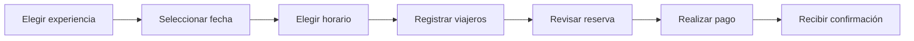
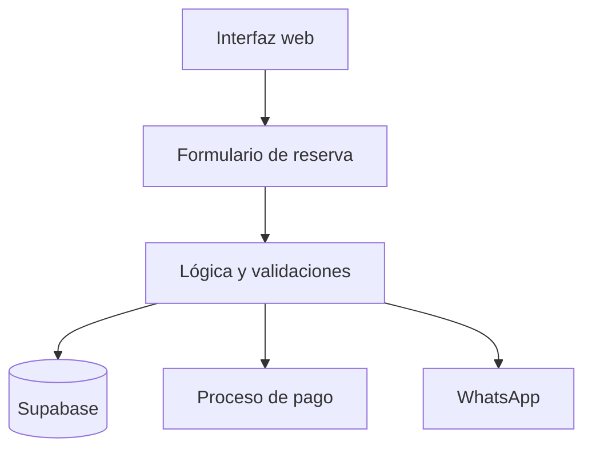

<div align="center">

# 🏜️ Checua

### Experiencias memorables en el Desierto de Checua

**Plataforma digital de reservas turísticas diseñada para descubrir, planificar y reservar experiencias de forma sencilla, segura y cercana.**

[](#estado-del-proyecto)
[](#experiencia-bilingüe)
[](#arquitectura)
[](#licencia)

[Características](#características-principales) ·
[Flujo de reserva](#flujo-de-reserva) ·
[Instalación](#instalación-local) ·
[Configuración](#variables-de-entorno) ·
[Contribución](#contribución)

</div>

---

## Sobre Checua

**Checua** es una plataforma web enfocada en la promoción y reserva de experiencias turísticas en el Desierto de Checua, Colombia. Su propósito es conectar a los visitantes con actividades auténticas del territorio mediante un proceso de reserva claro, intuitivo y adaptado a dispositivos móviles.

La aplicación reúne en un solo lugar la selección de experiencias, fechas, horarios, acompañantes, resumen de compra, pago y contacto por WhatsApp. Además, incorpora una experiencia bilingüe para atender tanto a visitantes nacionales como internacionales.

> Más que una reserva, Checua busca ser el inicio de una experiencia inolvidable.

## Características principales

### Descubrimiento de experiencias

- Catálogo visual de actividades y planes turísticos.
- Información clara sobre cada experiencia.
- Selección guiada para reducir dudas durante la reserva.
- Diseño enfocado en transmitir la identidad natural y cultural de Checua.

### Reservas paso a paso

- Selección de experiencia.
- Elección de fecha disponible.
- Selección de horario.
- Registro del número de acompañantes.
- Resumen completo antes de confirmar.
- Validación de datos durante cada etapa del proceso.

### Gestión de acompañantes

- Registro de la información necesaria de los participantes.
- Organización de grupos dentro de una misma reserva.
- Confirmación del número total de viajeros.
- Datos preparados para facilitar la atención operativa.

### Pagos y confirmación

- Preparación del resumen de compra.
- Flujo de pago integrado con la reserva.
- Confirmación clara del estado del proceso.
- Información centralizada para evitar errores o reservas incompletas.

### Integración con WhatsApp

- Canal de contacto directo con el equipo.
- Apoyo personalizado antes o después de reservar.
- Continuidad rápida entre la experiencia web y la atención humana.
- Opción práctica para resolver preguntas específicas del visitante.

### Experiencia bilingüe

La interfaz está preparada para ofrecer contenido en:

- 🇨🇴 Español
- 🇺🇸 Inglés

Esto permite ampliar el alcance de las experiencias y brindar una navegación más cómoda a viajeros internacionales.

### Diseño adaptable

- Experiencia optimizada para celulares, tabletas y computadores.
- Interfaz limpia y orientada a la conversión.
- Navegación progresiva y fácil de comprender.
- Componentes visuales consistentes.
- Prioridad en legibilidad, accesibilidad y rapidez.

## Flujo de reserva



Cada paso conserva el contexto de la reserva para que el visitante pueda avanzar con confianza y revisar la información antes de confirmar.

## Arquitectura

Checua está planteado como una aplicación web moderna con separación entre la experiencia de usuario, la lógica de reservas y la persistencia de datos.



### Componentes funcionales

| Componente | Responsabilidad |
|---|---|
| Interfaz web | Presentación de experiencias y navegación |
| Formulario de reserva | Captura progresiva de la información |
| Validaciones | Control de fechas, horarios y datos requeridos |
| Supabase | Persistencia y consulta de información |
| Pagos | Confirmación económica de la reserva |
| WhatsApp | Atención y comunicación directa |
| Internacionalización | Gestión de contenidos en español e inglés |

## Tecnología

La solución utiliza herramientas modernas para mantener una experiencia rápida, escalable y fácil de evolucionar:

- **Frontend web moderno** basado en componentes reutilizables.
- **Supabase** para servicios de backend y almacenamiento de datos.
- **Variables de entorno** para proteger configuraciones sensibles.
- **Diseño responsive** para diferentes tamaños de pantalla.
- **Internacionalización** para contenido bilingüe.
- **Integraciones externas** para pagos y comunicación.

> Las tecnologías y versiones exactas deben consultarse en los archivos de configuración del proyecto.

## Instalación local

### Requisitos previos

Antes de comenzar, instala:

- [Git](https://git-scm.com/)
- [Node.js](https://nodejs.org/) en una versión LTS
- npm, incluido con Node.js
- Un proyecto de [Supabase](https://supabase.com/)

### 1. Clonar el repositorio

```bash
git clone https://github.com/Eduar-Construcciones-S-A-S/Checua.git
cd Checua
```

### 2. Instalar dependencias

```bash
npm install
```

### 3. Configurar el entorno

Crea un archivo `.env.local` a partir del archivo de ejemplo cuando este se encuentre disponible:

```bash
cp .env.example .env.local
```

Completa las variables requeridas para Supabase y las integraciones habilitadas.

### 4. Iniciar el entorno de desarrollo

```bash
npm run dev
```

Abre la dirección local indicada en la terminal, normalmente:

```text
http://localhost:3000
```

## Variables de entorno

Las credenciales deben mantenerse fuera del repositorio. Una configuración típica puede incluir:

```env
# Supabase
NEXT_PUBLIC_SUPABASE_URL=
NEXT_PUBLIC_SUPABASE_ANON_KEY=

# Integraciones
NEXT_PUBLIC_WHATSAPP_NUMBER=
PAYMENT_PROVIDER_PUBLIC_KEY=
PAYMENT_PROVIDER_SECRET_KEY=
```

> Los nombres definitivos dependen de la implementación. Nunca publiques claves privadas, tokens o credenciales reales en GitHub.

## Estructura recomendada

```text
Checua/
├── public/              # Recursos estáticos
├── src/
│   ├── components/      # Componentes reutilizables
│   ├── pages/           # Páginas o rutas
│   ├── features/        # Módulos funcionales
│   ├── services/        # Supabase e integraciones
│   ├── hooks/           # Lógica reutilizable
│   ├── i18n/            # Traducciones
│   ├── styles/          # Estilos globales
│   └── utils/           # Utilidades y validaciones
├── .env.example         # Variables documentadas
├── package.json
└── README.md
```

La estructura real del proyecto puede variar según el framework y su evolución.

## Modelo funcional de la reserva

Una reserva reúne, como mínimo, la siguiente información:

| Categoría | Información |
|---|---|
| Experiencia | Actividad o plan seleccionado |
| Programación | Fecha y horario |
| Visitantes | Titular y acompañantes |
| Contacto | Datos necesarios para la confirmación |
| Pago | Valor y estado de la transacción |
| Seguimiento | Estado general de la reserva |

## Seguridad y buenas prácticas

- No almacenar secretos directamente en el código.
- Validar la información tanto en el cliente como en el servidor.
- Aplicar políticas de acceso en Supabase.
- Limitar los permisos de cada integración.
- Sanitizar los datos ingresados por los usuarios.
- Proteger las operaciones relacionadas con pagos.
- Mantener dependencias actualizadas.
- Evitar registrar información sensible en consola.
- Utilizar HTTPS en ambientes públicos.

## Accesibilidad y experiencia de usuario

Checua busca que el proceso de reserva pueda ser utilizado por la mayor cantidad de personas posible. Para ello se recomienda:

- Mantener contraste suficiente entre texto y fondo.
- Incluir etiquetas claras en todos los campos.
- Permitir navegación mediante teclado.
- Mostrar mensajes de error comprensibles.
- Evitar depender únicamente del color para comunicar estados.
- Optimizar imágenes sin perder calidad visual.
- Respetar las preferencias de movimiento reducido.

## Calidad

Antes de publicar cambios se recomienda ejecutar las verificaciones disponibles en el proyecto:

```bash
npm run lint
npm run build
```

Si existen pruebas automatizadas:

```bash
npm test
```

Todo cambio debe conservar el funcionamiento del flujo completo de reserva en vista móvil y de escritorio.

## Despliegue

Para desplegar la aplicación:

1. Configura las variables de entorno en la plataforma de alojamiento.
2. Conecta el repositorio con el proveedor de despliegue.
3. Verifica que Supabase acepte el dominio de producción.
4. Configura las credenciales de pagos y WhatsApp para el entorno correspondiente.
5. Ejecuta una reserva de prueba de principio a fin.
6. Comprueba la experiencia en español e inglés.

## Estado del proyecto

🚧 **En desarrollo activo**

Las funcionalidades, integraciones y decisiones técnicas pueden cambiar conforme avance el producto. Consulta el historial de commits y las ramas activas para conocer el estado más reciente.

## Hoja de ruta

- [x] Flujo guiado de reservas
- [x] Selección de experiencias
- [x] Fechas, horarios y acompañantes
- [x] Resumen de la reserva
- [x] Interfaz bilingüe
- [x] Integración con Supabase
- [x] Contacto mediante WhatsApp
- [ ] Fortalecer pruebas automatizadas
- [ ] Mejorar analítica y seguimiento de conversiones
- [ ] Ampliar herramientas de administración
- [ ] Optimizar accesibilidad y rendimiento
- [ ] Incorporar nuevas experiencias y paquetes

## Contribución

Este repositorio corresponde a un proyecto gestionado por **Eduar Construcciones S.A.S.** Si formas parte del equipo y deseas contribuir:

1. Crea una rama desde `main`.
2. Utiliza un nombre descriptivo, por ejemplo `feature/nueva-experiencia`.
3. Realiza cambios pequeños y enfocados.
4. Verifica lint, compilación y pruebas.
5. Escribe commits claros.
6. Abre un Pull Request explicando el objetivo y las pruebas realizadas.
7. Solicita revisión antes de integrar los cambios.

### Convención sugerida de commits

```text
feat: agrega una nueva funcionalidad
fix: corrige un comportamiento
docs: actualiza documentación
style: ajusta presentación sin cambiar lógica
refactor: reorganiza código
test: agrega o modifica pruebas
chore: realiza tareas de mantenimiento
```

## Licencia

Este proyecto es de uso privado y todos los derechos están reservados. No se autoriza su copia, distribución, modificación ni uso comercial sin permiso expreso del propietario.

---

<div align="center">

### 🏜️ Checua

**Naturaleza, aventura y experiencias que dejan huella.**

Proyecto realizado por **Brayan Forigua**.

Desarrollado con dedicación en Colombia 🇨🇴

</div>
